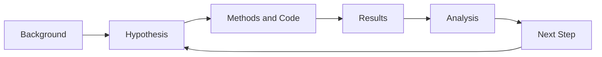
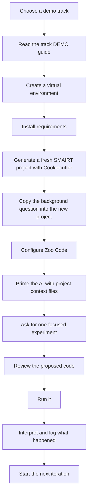

# SMAIRT Demo Collection

[](../smairt-template/README.md)
[](../smairt-template/README.md)
[](../smairt-template/README.md)
[](USING_ZOO_CODE.md)
[](README.md)
[](USING_ZOO_CODE.md)

**A professional, scientist-friendly set of SMAIRT demos for learning how to do reproducible, AI-assisted research without giving up scientific judgment.**

SMAIRT stands for **Scientific Method with AI Research Template**. These demos are designed to help a scientist, student, reviewer, or curious newcomer understand the framework quickly, pick a domain-specific example, and run an honest first research iteration.


---

## What SMAIRT is, in plain language

SMAIRT is a way to use an AI coding assistant like a research collaborator **without pretending the AI is the scientist**.

The AI helps you move faster: it can summarize context, draft code, propose experiments, and help keep a clean record. But **you** still decide:

- what question matters
- what assumptions are acceptable
- whether the code is correct
- whether the result is believable
- what the next experiment should be

That combination is the point of the framework: **AI speed with human scientific control**.

---

## Why these demos exist

These demo folders are not just toy scripts. They are meant to show scientists how to:

1. start from a research question
2. create a fresh SMAIRT project
3. prime an AI assistant with the right context
4. run a focused, reviewable experiment
5. interpret the result honestly
6. continue for multiple iterations with a reproducible audit trail

The finished product is not just code. It is a **followable reasoning trail** showing what was asked, what was run, what happened, and what was concluded.

---

## The SMAIRT loop

Every SMAIRT project follows the same core loop.



### What each step means

- **Background** — what is known, what is being asked, and what assumptions or constraints matter
- **Hypothesis** — a specific, testable claim
- **Methods and Code** — the script, data, model, or query used to test the claim
- **Results** — the raw outputs, figures, logs, tables, or measurements
- **Analysis** — what the result means, what it does **not** mean, and what to do next
- **Next Step** — the updated question for the next iteration

### The four project artifacts SMAIRT tries to preserve

A good SMAIRT iteration produces four concrete pieces of evidence inside the generated project:

1. **Background context**
2. **Hypothesis file**
3. **Experiment script or analysis method**
4. **Results plus interpretation**

That structure is what makes the workflow reproducible, hand-off friendly, and recoverable when an AI session gets lost.

---

## What AI does vs. what the scientist does

| AI is good at | The scientist must still do |
|---------------|-----------------------------|
| turning context into draft code | deciding whether the question is meaningful |
| proposing a first experiment | checking assumptions and units |
| editing files quickly | rejecting bad ideas and narrowing scope |
| keeping naming and logging consistent | interpreting whether the result is scientifically credible |
| summarizing logs and prior work | deciding what the next iteration should be |

If the AI is wrong, overconfident, or vague, that is **not** a failure of SMAIRT. Catching that is part of the scientific workflow.

---

## Demo track gallery

The demos below are organized so a scientist can choose an approachable domain and practice the same SMAIRT loop in different styles.

### Core showcase tracks

These are the main scientist-facing showcase demos for learning the framework.

| Track | Domain | Difficulty | Data style | What you learn | Start here |
|------|--------|------------|------------|----------------|-----------|
| Lunar free-return trajectory | Physics | Beginner | Synthetic only | Numerical modeling, parameter sweeps, trajectory interpretation | [`lunar/DEMO.md`](lunar/DEMO.md) |
| Enzyme kinetics | Biochemistry | Beginner | Synthetic first | Nonlinear fitting, parameter recovery, noisy-data interpretation | [`enzyme_kinetics/DEMO.md`](enzyme_kinetics/DEMO.md) |
| Peptide digestion | Proteomics | Beginner | Synthetic first | Rule-based biology, exact validation, observable peptide filtering | [`peptide_digest/DEMO.md`](peptide_digest/DEMO.md) |
| Protein sequence properties | Protein biochemistry | Beginner to intermediate | Synthetic first, optional real later | MW, pI, GRAVY, thresholding, simple classification | [`protein_properties/DEMO.md`](protein_properties/DEMO.md) |
| Differential abundance | Quantitative proteomics | Intermediate | Synthetic first, optional real later | Statistics, multiple testing, planted truth, false discovery control | [`proteomics_de/DEMO.md`](proteomics_de/DEMO.md) |
| Protein interaction networks | Network biology | Intermediate | Synthetic first | Graph analysis, centrality, communities, planted structure recovery | [`ppi_network/DEMO.md`](ppi_network/DEMO.md) |

### Extended tracks

These extend the collection beyond the six core showcase demos.

| Track | Domain | Difficulty | Data style | Notes | Start here |
|------|--------|------------|------------|-------|-----------|
| Human Virome Project | Database biology / metagenomics | Advanced | Real database | Uses PostgreSQL or a SQLite export; more infrastructure-heavy but scientifically rich | [`hvp/DEMO.md`](hvp/DEMO.md) |
| Bring your own problem | Any scientific domain | Flexible | Your choice | Best if you already have a question and want the SMAIRT scaffold plus guardrails | [`bring_your_own/DEMO.md`](bring_your_own/DEMO.md) |
| Protein language model | Computational biology / ML | Planned | Synthetic first | Background exists, but this track still needs a polished walkthrough comparable to the others | [`protein_lm/background/01_initial_question.md`](protein_lm/background/01_initial_question.md) |

### Track selection guide

- Pick **Lunar**, **Enzyme Kinetics**, or **Peptide Digestion** if you want the fastest setup.
- Pick **Protein Properties**, **Differential Abundance**, or **PPI Network** if you want a biology-first showcase with a few natural iterations.
- Pick **HVP** if you want a more realistic database-backed analysis.
- Pick **Bring Your Own Problem** if you already have a research idea.

---

## How a participant actually uses this repo



---

## Quick start

### 1. Pick a track

Start with one of the demo folders above, then open that folder's [`DEMO.md`](lunar/DEMO.md).

### 2. Create a virtual environment

Run these commands **from the demo folder you chose**. For example, if you choose the lunar track, run them from [`lunar/`](lunar/DEMO.md).

```bash
python3 -m venv .venv
source .venv/bin/activate     # Windows PowerShell: .venv\Scripts\Activate.ps1
pip install -r requirements.txt
```

If PowerShell blocks activation on Windows, run:

```powershell
Set-ExecutionPolicy -Scope Process -ExecutionPolicy Bypass
```

Then try activation again.

### 3. Generate a fresh SMAIRT project

```bash
cookiecutter https://github.com/biodataganache/smairt-template.git
```

Each track's [`DEMO.md`](lunar/DEMO.md) provides suggested answers for the Cookiecutter prompts.

### 4. Configure Zoo Code

If you are new to the AI workflow, read [`USING_ZOO_CODE.md`](USING_ZOO_CODE.md).

Recommended workshop settings:

| Setting | Value |
|---------|-------|
| API Provider | OpenAI Compatible |
| API key source | PNNL Birthright key from `https://ai-incubator-depot.pnnl.gov/` |
| API Base URL | `https://ai-incubator-api.pnnl.gov` |
| Model | `gpt-5-birthright` first, then `gpt-5.5-project` if needed |

> The `depot` URL is only where the key is created. The API Base URL inside Zoo Code must be `https://ai-incubator-api.pnnl.gov`.

### 5. Prime the assistant before asking for code

In your new SMAIRT project, the assistant should read these files first:

1. `prompts/AI_CONTEXT.md`
2. `prompts/CODE_CONVENTIONS.md`
3. `background/01_initial_question.md`

That keeps the interaction anchored to the framework rather than drifting into generic code generation.

---

## What a finished demo should look like

A representable SMAIRT demo should leave behind a breadcrumb trail that a scientist or reviewer can follow:

- a clear background question
- one or more numbered hypotheses
- numbered experiment scripts
- auto-captured logs in `results/logs/`
- analysis files explaining what happened
- a record of the human judgment calls that mattered

The completed lunar example shows what a multi-iteration trail can look like, but the goal of this repo is to make **all major showcase tracks** feel equally approachable and followable over 3 to 5 iterations.

---

## Repository map

| Path | What it contains |
|------|------------------|
| [`README.md`](README.md) | This landing page for the demo collection |
| [`USING_ZOO_CODE.md`](USING_ZOO_CODE.md) | First-time Zoo Code setup and human-in-the-loop workflow guidance |
| [`demo_tracks.svg`](demo_tracks.svg) | Visual summary of the demo tracks |
| [`lunar/`](lunar/DEMO.md) | Physics demo with a completed 3-iteration reference project |
| [`enzyme_kinetics/`](enzyme_kinetics/DEMO.md) | Small nonlinear-fitting demo |
| [`peptide_digest/`](peptide_digest/DEMO.md) | Exact, rule-based proteomics demo |
| [`protein_properties/`](protein_properties/DEMO.md) | Protein feature calculation and classification demo |
| [`proteomics_de/`](proteomics_de/DEMO.md) | Differential-abundance statistics demo |
| [`ppi_network/`](ppi_network/DEMO.md) | Graph-based biology demo |
| [`hvp/`](hvp/DEMO.md) | Database-backed virome demo |
| [`bring_your_own/`](bring_your_own/DEMO.md) | Flexible worksheet-driven custom-project entry point |
| [`../smairt-template/`](../smairt-template/README.md) | The canonical SMAIRT Cookiecutter framework |
| [`../smairt-agentic/`](../smairt-agentic/README.md) | SMAIRT agentic tooling and CLI |

---

## FAQ for non-experts

### Do I need to already know the domain science?

No. The demos are designed to make the workflow understandable even if you are learning the domain as you go. You do, however, need to review whether the AI's assumptions and outputs make sense.

### Do I need to trust the AI?

No. You need to **review** the AI. SMAIRT assumes the assistant will sometimes be wrong, shallow, or overconfident.

### What if the AI gets stuck or loses context?

Start a fresh task, re-attach the project context files, and continue from the files already on disk. SMAIRT is designed to recover from session failure because the project files hold the state.

### Are these demos solutions?

No. Most folders are starting points and walkthroughs, not completed answers. The objective is to show how a scientist can build the answer through iterative, reviewable work.

### Why so much emphasis on synthetic data first?

Because synthetic data gives you a known answer. If your method cannot recover a planted signal in a controlled setting, you should not trust it on real data yet.

---

## Important notes

- Review AI-generated code before running it.
- Keep requests small and specific.
- Record interpretation, not just output.
- Be honest about model limits and data caveats.
- Treat these demos as scaffolds for scientific reasoning, not autonomous pipelines.

SMAIRT works best when the repo teaches both **how to run the framework** and **how to think inside it**.
