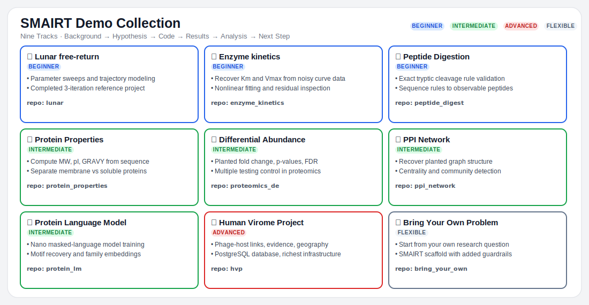

# SMAIRT TechFest Demos

Welcome to the participant workspace for the SMAIRT TechFest demos.

SMAIRT stands for **Scientific Method with AI Research Template**. These demos show how to use an AI coding assistant while keeping the scientist in control of the question, assumptions, code review, interpretation, and next steps.

You will choose one demo track, generate a fresh SMAIRT project, prime Zoo Code with the project context, and run one documented research iteration.



---

## Choose a demo track

| Track | Best for | Start here |
|-------|----------|------------|
| Lunar free-return trajectory | A compact physics example with no external data. Good if you are newer to coding or want the fastest setup. | [`lunar/DEMO.md`](lunar/DEMO.md) |
| Human Virome Project | A database example about phage-host links, CRISPR evidence, Hi-C evidence, geography, and gene function. Requires PostgreSQL setup unless a presenter provides a database or fallback. | [`hvp/DEMO.md`](hvp/DEMO.md) |
| Bring your own problem | Your own research question. Good if you already have an idea and want to turn it into a first SMAIRT iteration. | [`bring_your_own/DEMO.md`](bring_your_own/DEMO.md) |

---

## What you will do

Each demo follows the same basic flow:

1. Pick a track.
2. Read that track's `DEMO.md` file and background question.
3. Create a Python virtual environment.
4. Install the track requirements.
5. Generate a fresh SMAIRT project with Cookiecutter.
6. Configure Zoo Code.
7. Paste the priming prompt so Zoo Code reads the project context files.
8. Ask for one analysis script.
9. Review the script before running it.
10. Run it, interpret the result, and log what you learned.

The point is not to let AI run the project by itself. The point is to use AI speed while preserving a reproducible record of the scientific process.

---

## First-time Zoo Code setup

If you are new to Zoo Code, read this first:

[`USING_ZOO_CODE.md`](USING_ZOO_CODE.md)

For this workshop, configure Zoo Code with:

| Setting | Value |
|---------|-------|
| API Provider | OpenAI Compatible |
| API key | Create a PNNL Birthright key at https://ai-incubator-depot.pnnl.gov/ |
| API Base URL | `https://ai-incubator-api.pnnl.gov` |
| Model | `gpt-5.5-project` |

---

## Common setup pattern

Run these commands from the demo folder you choose. For example, use `demos/lunar` for the Lunar track.

```bash
python3 -m venv .venv
source .venv/bin/activate     # Windows: .venv\Scripts\activate
pip install -r requirements.txt
```

Then generate a new SMAIRT project:

```bash
cookiecutter https://github.com/biodataganache/smairt-template.git
```

Each track's `DEMO.md` gives the exact Cookiecutter answers to use.

---

## What the folders contain

| Path | Contents |
|------|----------|
| [`lunar/`](lunar/DEMO.md) | Lunar free-return demo instructions, requirements, and background question. |
| [`hvp/`](hvp/DEMO.md) | HVP demo instructions, database build files, requirements, and background question. |
| [`bring_your_own/`](bring_your_own/DEMO.md) | Bring-your-own-problem instructions, worksheet, and starter requirements. |
| [`USING_ZOO_CODE.md`](USING_ZOO_CODE.md) | First-time Zoo Code setup and workflow guidance. |
| [`demo_tracks.svg`](demo_tracks.svg) | Visual summary of the three demo tracks. |

---

## Important notes

- These folders are starting points, not solutions.
- Worked reference solutions are not in this participant folder.
- Review AI-generated code before running it.
- Record your interpretation in the generated SMAIRT project.
- If Zoo Code gets stuck, start a new task and re-prime it from your project files.

Your final product is not just a script. It is a documented reasoning trail that shows what you asked, what was run, what happened, and what you concluded.
